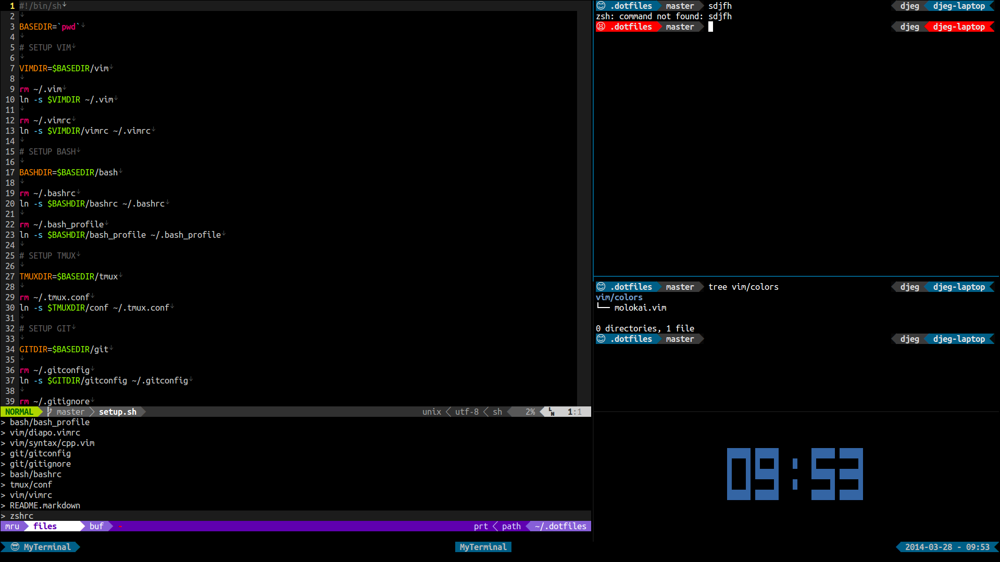

My dotfiles ^.^
===============

> One Shell to rule them all, One Shell to find them,
>
> One Shell to bring them all and in the darkness bind them.
>
> In the Land of Command Lines where the Shadows lie.

## Installation

Clone the repository in your HOME directory (this is important!):

    $ git clone --recursive git://github.com/davidjegat/dotfiles.git ~/.dotfiles

Go to the cloned repository

    $ cd ~/.dotfiles

Execute the setup script:

    $ ./setup.sh
